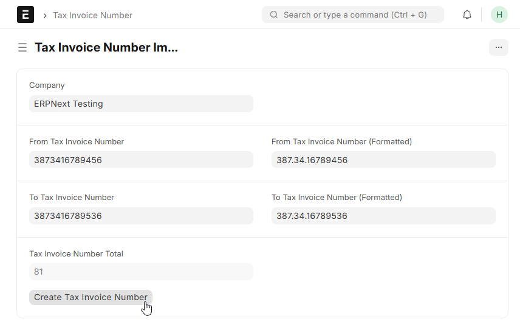
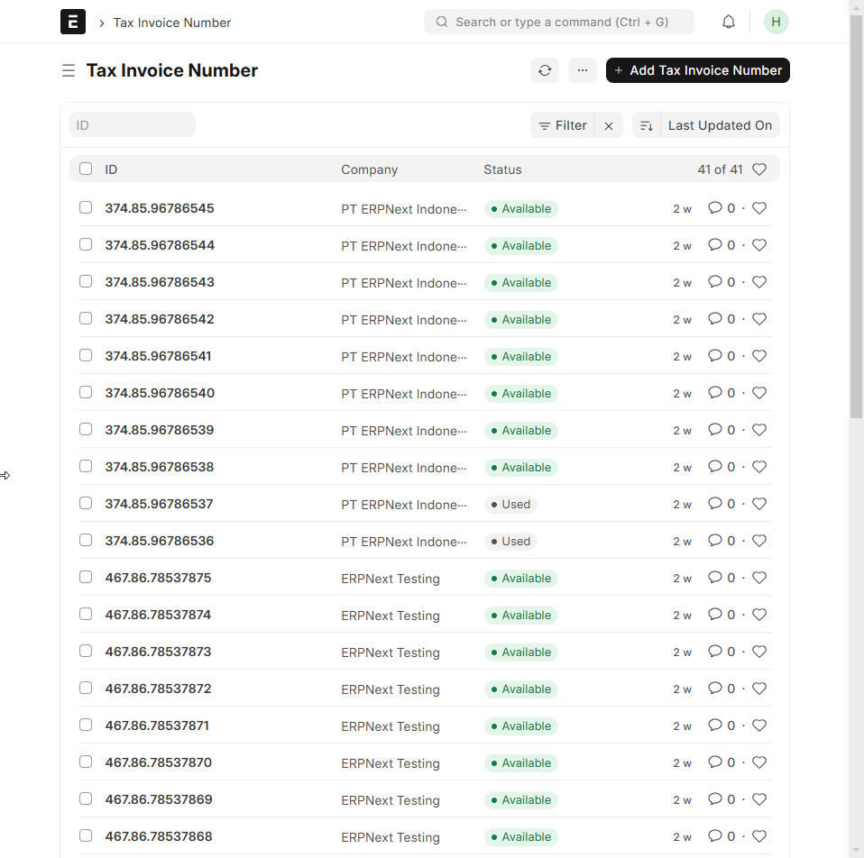
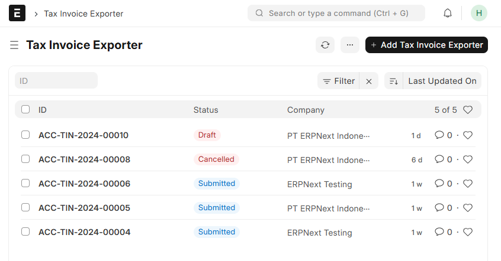
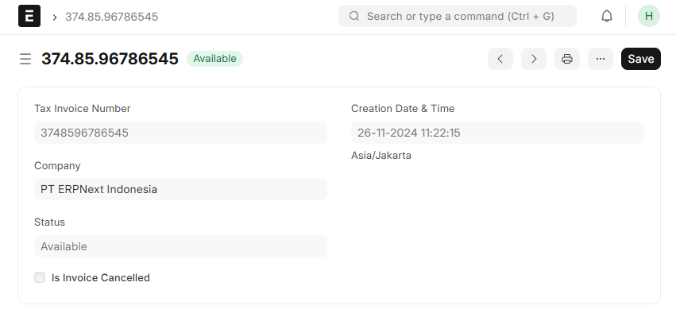
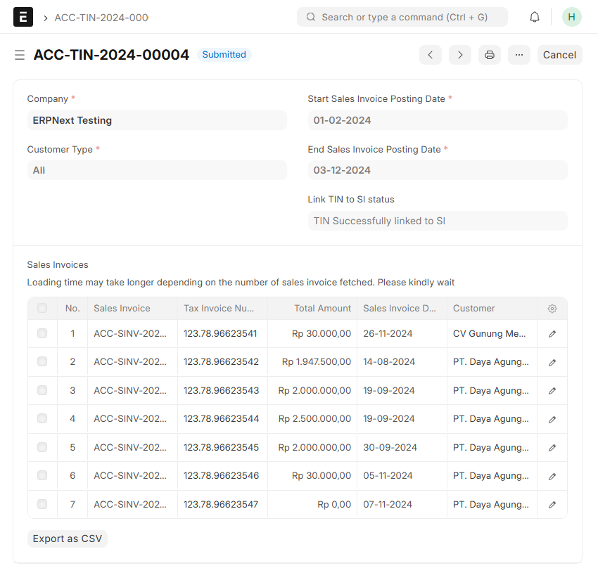

# ERPNext IndonesiaLocalizationUser Manual

### ERPNext Indonesia Localization (v0.1.0)
#### About
"ERPNext Indonesia Localization" is a custom application for ERPNext designedtostreamlinecompliance with Indonesia's tax regulations. The app can generate CSV file withthelaw-regulated format required by Indonesian Tax Office (Direktorat Jenderal Pajak) forhassle-free uploading to the e-Nofa app, ensuring precise Tax Invoice Number (NomorFakturPajak) assignment to each Sales Invoice. This application enhances operational efficiencywhile reducing the risk of errors, providing a reliable solution for Indonesian tax management.This app runs on ERPNext versions 14 and 15, with document:
-  Indonesia Localization Settings
- Tax Invoice Number Importer
- Tax Invoice Number
-  Tax Invoice Exporter

All of the listed doctype and it’s necessary shortcuts are listed in a dedicated workspace called **Indonesia Localization Workspace**

### ERPNext Indonesia Localization User Manual
#### Initial setup steps for ERPNext Indonesia Localization:
1. Create a new site on a private server or Frappe Cloud and install the following apps:
    - ERPNext (v15)
    - ERPNext Indonesia Localization
2. After the site is created, log in as Administrator to the site that has been set up
3. When first entering the site, the user will be faced with the Setup Wizard menu. Someinformation that must be filled in:
    - Set up the region according to your needs, MANDATORY to select IndonesiaintheYourCountry option, click Next
    - Set up the user according to your needs, click Next
    - Set up the organization according to your needs, MANDATORY to select StandardintheChart of Accounts option
    - Click Complete Setup
4. The ERPNext site with ERPNext Indonesia Localization can now be used

ERPNext Indonesia Localization includes a special flow for creating Tax Invoice reports regulated by the Indonesian government in the tax setup in ERPNext.
ERPNext Indonesia Localization menyertakan alur khusus untuk membuat laporan Faktur Pajak yang diatur pemerintah Indonesia dalam setup perpajakan dalam ERPNext.

### Features on ERPNext Indonesia Localization:

- Tax Invoice Number Importer, doctype to import Tax Invoice Number from the Indonesian Directorate General of Taxes
- Tax Invoice Number, doctype to include a unique Tax Invoice Number
- Tax Invoice Exporter, doctype to create tax invoices for corporate tax reporting needs
- Indonesia Localization Settings, single doctype as the main setting for tax reporting settings
- Workspace with defined shortcuts and listed features in Indonesian

### Doctype
#### I. Indonesia Localization Settings

A single doctype used for configuring features available in the Indonesia Tax and Charges application. Explanation of each field in Indonesia Localization Settings:

- **Tax Invoice Number Length**: The number of digits in the Tax Invoice Number. Default value is 13 digits.
- **Invoice Name in eFaktur Template**:
    - Description: Select a specific field name in the Sales Invoice doctype as the invoice number in the Tax Invoice Exporter template.
    - This field is used to store the field name from the Sales Invoice doctype, which will be used in the 'REFERENSI' column of the CSV file.
    - If not filled: The 'REFERENSI' column in the CSV file will take the value from the 'NAME' field in the Sales Invoice doctype.
    - If filled: The 'REFERENSI' column will take the value from the specified field in the Sales Invoice doctype.
- **Minimum Tax Invoice Number Threshold**: The threshold number of  Tax Invoice Number  in the system. User will be notified when openning Tax Invoice Number
- **Use Amended From as TIN Revision Flag**: This checkbox toggles the feature to change the last character of the Tax Prefix Code from 0 to 1 if a Sales Invoice document has an 'Amended From' field that is not empty.
    - If checked: Each Sales Invoice with an 'Amended From' field will be recognized as a revised Sales Invoice, and the last character of the Tax Prefix Code will change from 0 to 1.
    - If unchecked: When revising a Sales Invoice by canceling and amending, the last character of the Tax Prefix Code will not change.
- **TIN Revision If Only SI Had TIN Before**: This checkbox toggles the process of checking if the Sales Invoice had a TIN before, that can be included in Tax Invoice Exporter
    - If checked: The Tax Invoice Number prefix will automatically change to the TIN Revisison prefix (e.g., 011)
    - If unchecked: No process to check the amount and change the prefix.
- Exclude Opening Entry: This checkbox toggles whether to exclude Sales Invoice documents marked as opening balance (Is Opening Entry = "Yes").
    - Used for cases where opening balance Sales Invoices already have a Tax Invoice Number before migration to the ERP system.
    - If checked: Sales Invoices marked as 'Is Opening Entry' = "Yes" will not be processed in the Tax Invoice Exporter.
    - If unchecked: Sales Invoices marked as 'Is Opening Entry' = "Yes" will be processed in the Tax Invoice Exporter.
- **Exclude Sales Invoice type Return**: This checkbox toggles whether to exclude Sales Invoice documents that is marked as return (Is Return  = "Yes").
- **No Faktur Format**: This checkbox toggles whether the generated CSV file automatically adds a dot (.) to the "NOMOR_FAKTUR" field values.
    - If checked: The "NOMOR_FAKTUR" field values in the CSV file will have a dot separator (e.g., 000.24.84766628).
    - If unchecked: No dots will be included in the "NOMOR_FAKTUR" field (e.g., 0002484766628).
- **Use Minimum Grand Total for WAPU**: This checkbox toggles the process of checking the minimum Grand Total of the Sales Invoice in the WAPU (Wajib Pungut) case.
    - If checked: The Tax Invoice Number prefix will automatically change to the WAPU prefix (e.g., 030) when the Grand Total amount reaches the value entered in the "Minimum Grand Total for WAPU" field.
    - If unchecked: No process to check the amount and change the prefix.
- **Minimum Grand Total for WAPU**: This field must be filled if the "Use Minimum Grand Total for WAPU" checkbox is checked.
    - It stores the minimum value for using the WAPU prefix.
- **Tax Prefix Codes (table)**: This table is used to configure the mapping of specific Tax Prefix Codes based on the Sales Taxes and Charges Template.
    - If a Sales Invoice does not have a Sales Taxes and Charges Template, it will not be picked up by the Tax Invoice Exporter.
    - If a Sales Invoice uses a Sales Taxes and Charges Template, but the Tax Prefix Code is mapped in this table, it will not be picked up by the Tax Invoice Exporter.

#### II. Tax Invoice Number Importer

A single doctype used for generating Tax Invoice Number document. Explanation of each field in Tax Invoice Number:

- Company, linked to Company and will be used in Tax Invoice Number CSV
- From Tax Invoice Number, setting up the starting number of Tax Invoice Number that will be generated
- To Tax Invoice Number, setting up the ending number of Tax Invoice Number that will be generated
- Tax Invoice Number Total, the count of Tax Invoice Number that will be generated
- Create Tax Invoice Number, the button to generate inputted Tax Invoice Numbers

After user click the Create Tax Invoice Number button, Tax Invoice Number will be automatically added and available to use.

#### III. Tax Invoice Number

A doctype used to store all the Tax Invoice Numbers generated in the Tax Invoice Importer doctype. In practice, this document will be used as a master data and tracks the usage of each Tax Invoice Number.
Explanation of each field in Tax Invoice Number document:
- **Tax Invoice Number**, the document name and the TIN itself

- **Creation Date & Time**, listed time when the the TIN Importer generate the doctype
- **Company**, linked to Company and will be used in Tax Invoice Number CSV
- **Status**, the state of the Tax Invoice Number
- **Is Invoice Cancelled**, a read-only checkbox to mark if the Tax Invoice Number is linked to a Sales Invoice that is Cancelled

#### IV. Tax Invoice Exporter

A doctype used to link Sales Invoices with Tax Invoice Numbers and then generating the CSV file. Below is the field in Tax Invoice Exporter:
- **Document Level** fields will be used as the parameters to filters Sales Invoice available to be linked with Tax Invoice Number. The field is:
    - Naming Series
    - Company
    - Customer Type
    - Start Sales Invoice Posting Date
    - End Sales Invoice Posting Date
    - Branch
- **Child Table Level** listing the details of available Sales Invoices with each of Tax Invoice Numbers, that is linked from Get Sales Invoice button. The field is:
    - Sales Invoice
    - Tax Invoice Number
    - Total Amount
    - Sales Invoice Date
    - Customer
    - Customer Name
    - Is Tax Invoice Number Unlinked from Invoice
    - Is Invoice Cancelled

### CSV Generation Flow

1. Set up the Indonesia Localization Settings doctype as per your business requirements,
2. Ensure that the master data in Customer is completed.
    - Tax ID
    - Company Name as per Tax ID
    - Company Address as per Tax ID
    - Customer Type
3. Generate Tax Invoice Number  using the Tax Invoice Importer doctype.
4. Ensure that there are Sales Invoice documents ready for processing.
5. Open the Tax Invoice Exporter document and fill in the fields.
6. Click 'Get Sales Invoices' to load the list of Sales Invoices based on the filter.
7. Submit the Tax Invoice Exporter document.
8. Click 'Export as CSV' to generate the CSV file based on the Sales Invoice data in the Tax Invoice Exporter.

